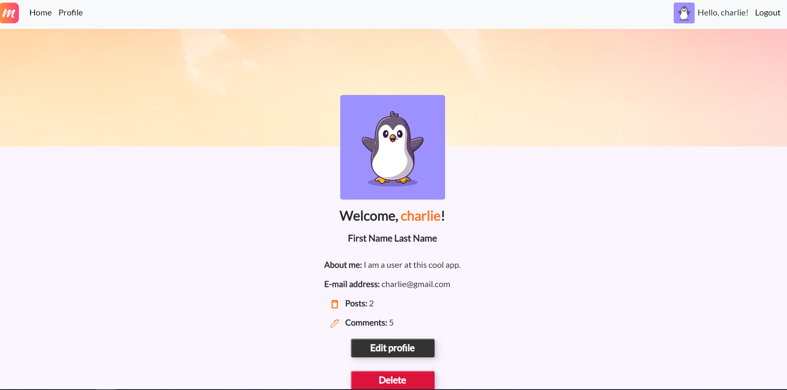
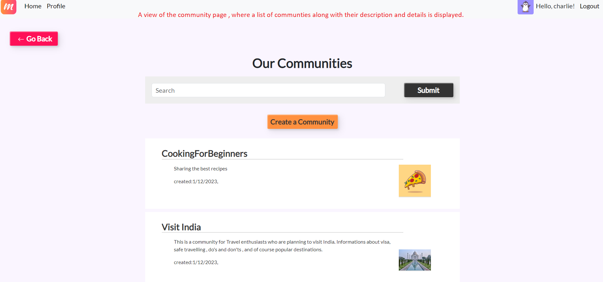
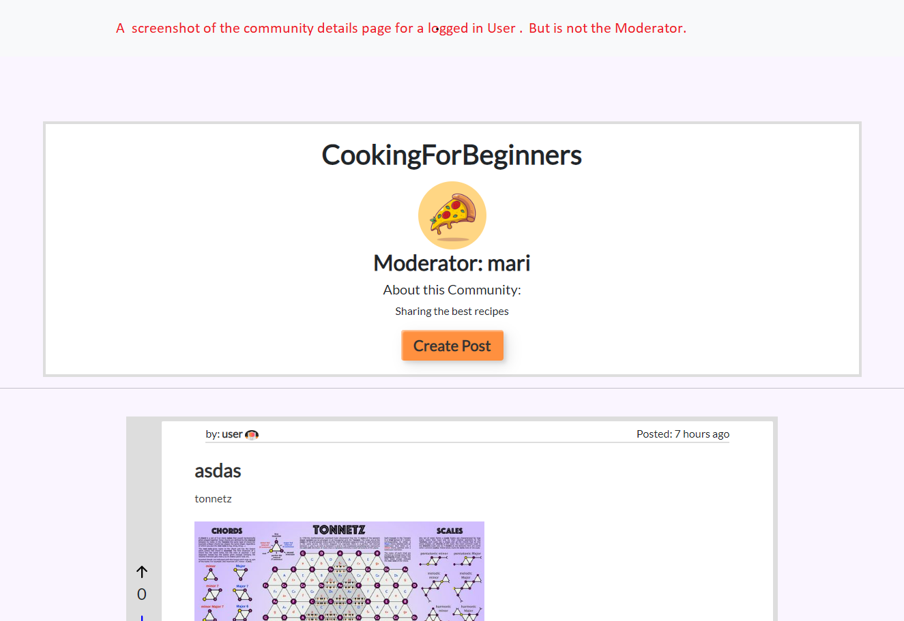
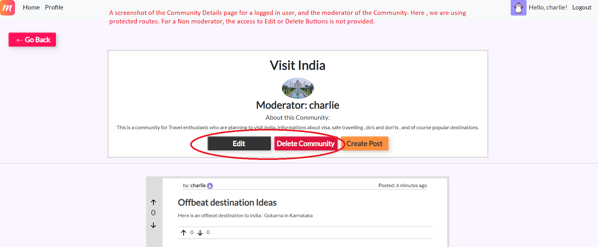

# Mingle: The ultimate social platform for connection and community.


Welcome to our social platform, where you can connect with the world, share photos, posts, belong to communities and stay up-to-date on the latest info and trends.
 With easy-to-use features and a user-friendly interface, our platform makes it simple to stay in touch and make new connections.
The ultimate social platform for connection and community.


## Created By :

This project was a collaboration of three people who shares similar passion for programming.
We did an awesome team-work and put in our best efforts and hard work into this project.

We are :

- Lovro Boric.
- Marine Dos Reis Pereira.
- Rumeli Paul.


## Mingle Features:

- Create Communities to connect with others who share similar interests.
- Posts : Share texts, images to be displayed on our feed.
- Comments : You can Comment on the posts.
- Votes : You can vote a Post.


## Functionalities :

 Mingle is a working full stack app made using Mongodb, Express and Node.js.
 We have implemented 

 - Sign up and Login For Users.
 - User can Create, Edit and Delete his/her profile.
- CRUD on multiple models like Post, Comment, Communities.
- Protected Routes for User profile, Posts, Communities and Comments.
- Validations and Authentication on Client and Server side.
- Conditional Rendering of Views.
- Upvotes and Downvotes.

## Screenshots
- Landing page


- Sign Up page


- User Profile page



- List of communities



- Community Views for Moderators and Non moderators





- Post details


To run this project , you will need to the following:

 You have to create an account with Cloudinary.
- [This is an external link to Cloudinary](https://cloudinary.com/)
## Environment Variables

To run this project, you will need to add the following environment variables to your .env file

`PORT`

`SESSION_SECRET`

`CLOUDINARY_NAME`

`CLOUDINARY_KEY`

`CLOUDINARY_SECRET`

## Deployment

### To Run this on Your LocalHost :
- Install the dependencies.

```bash
  npm install

```

- To run this Project :
```bash
  npm run dev

```

## Demo

Here is a link of our working app on Adaptable:

https://mingle.adaptable.app/
## 🔗 Link to Our Organisation
[https://github.com/Minglehackers/Mingle]

